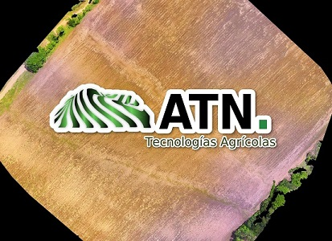

# QUICK SURVEY RTK QGIS PLUGIN 1.0 

Quick_survey_RTK is a Qgis plugin for quick collect points in field

Tool designed to capture points in the field in real time.
  The collected points are stored in a previously saved layer. The application is in charge of adding the points in the coordinates given under the configured filters.
  The points will be used for the generation of DEM of the surveyed land, with which level curves can be projected for the establishment of irrigation systems in crops such as rice.
  
  
 
  For models with acceptable precision, the use of GNSS RTK systems is necessary. Like Emlid Reach RS devices or any other RTK system.
  
  The tool is under development and I invite everyone to participate with me in its evolution.
This tool will help producers to implement current technologies in more efficient irrigation systems.

  

  On Windows, to quickly install the plugin, download repository, unzip and copy the master folder to its equivalent path, or clone the repository in the same path.

    C:\Users\username\AppData\Roaming\QGIS\QGIS3\profiles\default\python\plugins\

- [x] Configure access to GPS information
- [X] Set point filters
- [X] Debug interface
- [ ] Field tests
- [ ] Set rotation map in real time
- [ ] Project area calculation

### Version Control

- 1.0
